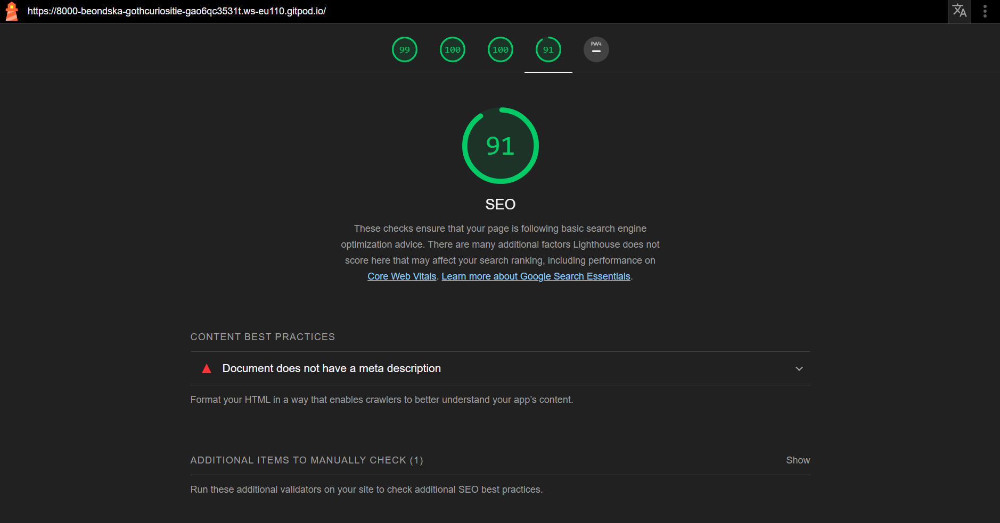

# GOTH CURIOSITIES QUIZ
## Can you guess this one?

You can reach the page [here](https://beondska.github.io/goth-curiosities/)

 Table of Contents
1. [Introduction](#introduction)
2. [About](#about)
3. [Features](#features)
4. [User Experience (UX)](#user-experience-ux)
5. [Design](#design)
6. [Testing](#testing)
7. [Known Issues](#known-issues)
8. [Deployment](#deployment)
9. [Media](#media)
10. [Credits & Acknowledgements](#credits--acknowledgements)

# INTRODUCTION

The intention behind this project is to create a small quiz to some of the things I find interesting. An extension of my love and the hobby I cultivated throw the years of my life growing up.

# ABOUT

Goth Curiosities Quiz has seven questions about Gothic Poetry, architecture and historic facts.
All pages were responsive and worked on smaller screens as well.  

# FEATURES

The first page of this quiz, has a welcome message and a button that once pressed iniciate the quiz.

- The button is present throgh all the questions of the quiz is fully accessible and responsive for users to navigate through the website.
- The button also has a hover effect when having your mouse pointer of the header colors with the overall theme.
- It brings the user to the first question and four options to answer .
- The whole site is responsive and works well for all kind of different devices.

**The Footer**

This footer is attached to every question and answears until the end of the quiz.
 

**Game Over**
- This section consist of an game over last page. Information is shown when the user finishes the quiz. There is a button to restart the game. You may also restart the game if you refresh the page.

## Design
### Color Scheme

For this project I choose colors that felt retro, intimate and timeless. This color-scheme reflects the epoch in its best.

# TESTING
**Navigation Links**

Testing was performed to ensure all navigation links on the respective pages navigated to the correct pages as per design. This was done by clicking on the navigation links on each page.

Links on all pages navigated to the correct pages as expected. Include the Error page.

**W3C Validator**
[WC3](https://validator.w3.org/) was used to validate all HTML, CSS and JavaScript.

**Responsiveness**

All pages were tested to ensure responsiveness on screen sizes as defined in WCAG 2.1 Reflow criteria for responsive design on Chrome, Edge, Firefox and Safari browsers. No horizontal scroll is present. No elements overlap.

**Lighthouse**
Used within the Chrome Developer Tools to test the performance, accessibility, best practices and SEO of the website.

# KNOWN ISSUES

# DEPLOYMENTS
I published the GitHub page with my website by going to my repository settings and under the code and automations, thus deploying the website to be live.

# CREDITS AND ACKNOWLEDGEMENTS
I would like to extend some thanks, not only to the online resources, but also to my Mother and my Father who taught me how to read and the endearing love for books.

 To my partime mentor and friend Willian, who aided me when I needed the most even thought we live in diferent time zones, he always make it work. To my friend Caroline for the emotional support, the strength and light when I wanted to give up and the humbles to explain the terms I couldnt figure out later in the night. Thank you.

 Credits to my friend's tutorial: https://www.youtube.com/watch?v=NjEqc-SVcYU  Miguel Maia .

 Also credit to the tutorial video sent by my mentor that helped me very much: https://www.youtube.com/watch?v=riDzcEQbX6k .